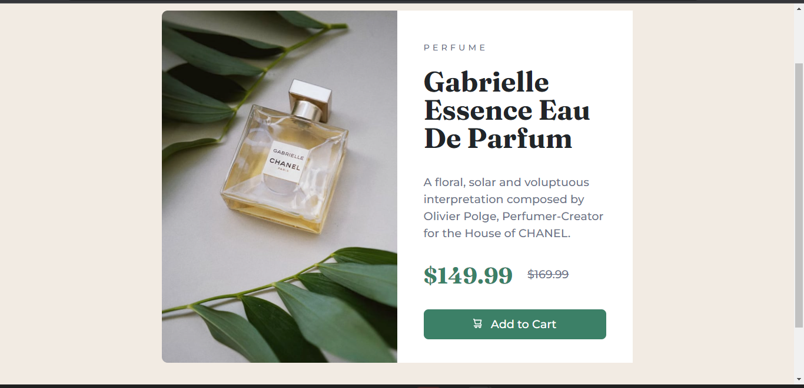

# Frontend Mentor - Product preview card component solution

This is a solution to the [Product preview card component challenge on Frontend Mentor](https://www.frontendmentor.io/challenges/product-preview-card-component-GO7UmttRfa). Frontend Mentor challenges help you improve your coding skills by building realistic projects. 

## Table of contents

- [Overview](#overview)
  - [The challenge](#the-challenge)
  - [Screenshot](#screenshot)
  - [Links](#links)
- [My process](#my-process)
  - [Built with](#built-with)
  - [What I learned](#what-i-learned)
  - [Continued development](#continued-development)
  - [Useful resources](#useful-resources)
- [Author](#author)
- [Acknowledgments](#acknowledgments)

## Overview

This is a solution to the [Product preview card component challenge on Frontend Mentor](https://www.frontendmentor.io/challenges/product-preview-card-component-GO7UmttRfa). I attempted to build out the project to the designs inside the `/design` folder that Frontend Mentor provided for the challenge. This project attempts to code both the mobile and the desktop version of the design for optimal responsiveness. 

### The challenge

Users should be able to:
- View the optimal layout depending on their device's screen size
- See hover and focus states for interactive elements

### Screenshot

### Links

- Solution URL: [Add solution URL here](https://your-solution-url.com)
- Live Site URL: [Add live site URL here](https://your-live-site-url.com)

## My process

I basically utilized CSS flex and media query for the project. It was really tough as this was my first practical coding challenge. I was having torubles making the layout responsive initially. I asked for help on stackoverflow and browsed through numerous useful sites. It is still not perfect, but I trust I have given it the best of my shots for this time being. I hope to still revisit the challenge and make it better sometime in the near future.

### Built with

- Semantic HTML5 markup
- CSS custom properties
- Flexbox
- Media Queries
- [Bootstrap](https://getbootstrap.com/) - Bootstrap 4.0 framework

### What I learned

Working through this project has really deepened my knowledge of css and mobile responsive design. 
To see how you can add code snippets, see below:

### Continued development

Aeas that you want to continue focusing on in future projects include @media width and height, css flex, css grid, bootstrap, and j.query.

## Author
- Frontend Mentor - [@Onyinye](https://www.frontendmentor.io/profile/Onyinye)
- Twitter - [@onyii_amor](https://www.twitter.com/onyii_amor)